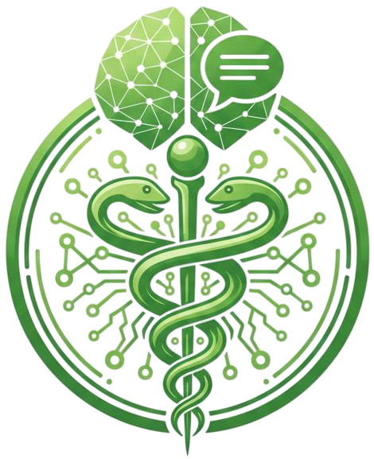

<div align="center">



# 💊 HooshDaroo (هوش دارو)

### AI-Powered Persian Pharmaceutical Assistant

[](https://www.python.org/)
[](https://streamlit.io/)
[](https://neo4j.com/)
[](https://github.com/facebookresearch/faiss)
[](https://ollama.com/)
[](LICENSE)

**HooshDaroo** is a bilingual (Persian/English) pharmaceutical chatbot that combines Retrieval-Augmented Generation (RAG) and Graph RAG over a pharmaceutical knowledge graph to deliver accurate, traceable, and evidence-backed answers to drug-related questions — powered entirely by local LLMs.

> 🏆 Developed as the final capstone project for the **Hamrahe Aval (MCI) AI Bootcamp** — February 2026.

</div>

---

## ✨ Features

- 🔍 **Hybrid Retrieval** — Combines BM25 sparse search and FAISS dense semantic search for robust context retrieval
- 🕸️ **Graph RAG** — Queries a Neo4j pharmaceutical knowledge graph using LLM-extracted entities and structured Cypher queries
- 🧠 **LLM-Based Entity Extraction** — Recognizes drugs, conditions, adverse effects, drug classes, populations, and more from user queries
- 🌐 **Bilingual Support** — Handles questions in both Persian (Farsi) and English; always responds in fluent Persian
- 💬 **Multi-Session Chat Management** — Create, name, and switch between multiple conversations with automatic summarization
- 📖 **Evidence-Backed Answers** — Every answer is grounded in retrieved context from the knowledge base; no hallucinated facts
- 🏃 **Fully Local Inference** — Answer generation via [Ollama](https://ollama.com/) + `gemma3:4b`, no external LLM API calls needed for generation
- 📊 **LLM-as-a-Judge Evaluation** — Built-in evaluation pipeline to benchmark answer quality
- 🎨 **Custom Dark UI** — Clean, responsive Streamlit interface with RTL Persian text support

---

## 🏗️ System Architecture

HooshDaroo uses a **dual-retrieval pipeline** that runs both a vector-based RAG and a knowledge-graph-based GraphRAG in parallel, fusing their contexts before sending to the generator LLM.

```
User Query (Persian/English)
        │
        ▼
┌───────────────────────────────────────────────────────────────────┐
│                        Query Analysis Layer                        │
│   Entity Extractor (AvalAI LLM)  │  Persian Text Normalizer (hazm)│
│   Entities: Drug, Condition,     │  Intent Classification:        │
│   AdverseEffect, DrugClass, ...  │  INDICATION, INTERACTION, ...  │
└───────────────────┬───────────────────────────┬───────────────────┘
                    │                           │
          ┌─────────▼──────────┐    ┌───────────▼────────────┐
          │     RAG Pipeline   │    │   Graph RAG Pipeline   │
          │  ─────────────── │    │  ─────────────────────  │
          │  BM25 (sparse)   │    │  Entity Linking         │
          │       +          │    │  (exact + fuzzy match)  │
          │  FAISS (dense)   │    │  ↓                      │
          │  ─────────────── │    │  Neo4j Cypher Queries   │
          │  Hybrid Fusion   │    │  (Indication, Interaction│
          │  (alpha=0.5)     │    │   AdverseEffect, ...)   │
          └─────────┬──────────┘    └───────────┬────────────┘
                    │                           │
                    └─────────────┬─────────────┘
                                  ▼
                    ┌─────────────────────────────┐
                    │     Generation Layer         │
                    │   Ollama + gemma3:4b (local) │
                    │   Streaming response         │
                    │   Persian output + sources   │
                    └─────────────────────────────┘
```

---

## 📁 Project Structure

```
HooshDaroo/
├── app.py                  # Main Streamlit web application
├── answer.py               # Orchestrates RAG + GraphRAG + LLM generation
├── rag.py                  # Hybrid BM25 + FAISS retrieval pipeline
├── graphrag.py             # Full Graph RAG pipeline (entity linking, Cypher queries)
├── entity_extractor.py     # LLM-based NER & intent classification
├── make_vector_db.py       # Script to build the Milvus vector database
├── chat.py                 # Multi-session chat management & summarization
├── prompts.py              # System and summarization prompts
├── evaluation.py           # LLM-as-a-Judge evaluation pipeline
├── utils.py                # Shared utilities (token counting, ID generation)
├── requirements.txt        # Python dependencies
├── file.env                # Environment variable template (rename to .env)
├── css/
│   └── styles.css          # Custom Streamlit styles
├── logo/
│   └── hooshdaroo.png      # Application logo
├── data/
│   └── rag_chunks_v5.json  # Preprocessed pharmaceutical document chunks
├── chats/                  # Persisted chat sessions (auto-created)
├── graph_refs/             # Saved GraphRAG query results (auto-created)
└── test/
    ├── questions.json       # Evaluation question set
    └── results_1.json       # Evaluation results output
```

---

## ⚙️ Tech Stack

| Component | Technology |
|---|---|
| **Frontend** | Streamlit |
| **Vector Database** | FAISS (runtime) / Milvus (indexing) |
| **Knowledge Graph** | Neo4j |
| **Embedding Model** | `QWEN3-Embedding-0.6B` (via SentenceTransformers) |
| **Local LLM (Generation)** | `gemma3:4b` via Ollama |
| **LLM API (Entity Extraction)** | AvalAI (OpenAI-compatible) |
| **Sparse Retrieval** | BM25 via `rank_bm25` |
| **Persian NLP** | `hazm` (normalization, tokenization) |
| **Fuzzy Matching** | `rapidfuzz` |
| **Token Counting** | `tiktoken` (`cl100k_base`) |

---

## 🚀 Getting Started

### Prerequisites

- Python 3.10+
- [Ollama](https://ollama.com/) installed and running
- [Neo4j](https://neo4j.com/download/) instance (local or cloud)
- A GPU is recommended for embedding inference (CUDA)

### 1. Clone the Repository

```bash
git clone https://github.com/your-username/HooshDaroo.git
cd HooshDaroo
```

### 2. Install Dependencies

```bash
pip install -r requirements.txt
```

### 3. Pull the Local LLM

```bash
ollama pull gemma3:4b
```

### 4. Configure Environment Variables

Copy the template and fill in your settings:

```bash
cp file.env .env
```

Then edit `.env`:

| Variable | Description | Default |
|---|---|---|
| `EMBEDDING_MODEL` | Path or HuggingFace name for the embedding model | `QWEN/QWEN3-Embedding-0.6B` |
| `EMBEDDING_DEVICE` | Device for embedding inference | `cuda` |
| `NEO4J_URI` | Neo4j connection URI | `bolt://localhost:7687` |
| `NEO4J_USER` | Neo4j username | `neo4j` |
| `NEO4J_PASSWORD` | Neo4j password | — |
| `VECTOR_INDEX_NAME` | Neo4j vector index name | `chunk_embedding_index` |
| `FAISS_URI` | Path to the FAISS index file | — |
| `FAISS_METADATA` | Path to the FAISS metadata pickle file | — |
| `MILVUS_URI` | Milvus server URI (for indexing step only) | — |
| `COLLECTION_NAME` | Milvus collection name | — |
| `AVALAI_API_KEY` | AvalAI API key (for entity extraction) | — |
| `AVALAI_BASE_URL` | AvalAI base URL | `https://api.avalai.ir/v1` |
| `AVALAI_LLM_MODEL` | Model for entity extraction | `gpt-4o-mini` |
| `AVALAI_REASONING_EFFORT` | Reasoning intensity | `minimal` |

### 5. Build the Vector Database (First Time)

If you are setting up from scratch, run the vector DB builder to embed and index your pharmaceutical chunks:

```bash
python make_vector_db.py
```

> **Note:** This requires a populated `data/rag_chunks_v5.json` file and a running Milvus instance.

### 6. Run the Application

```bash
streamlit run app.py
```

The app will open automatically in your browser at `http://localhost:8501`.

---

## 🧩 Module Details

### `rag.py` — Hybrid Retrieval
Implements a **hybrid BM25 + FAISS retrieval** strategy over pharmaceutical text chunks. At query time, BM25 sparse scores and FAISS dense cosine-similarity scores are each normalized and linearly fused:

```
final_score = α × bm25_score + (1 − α) × dense_score
```

The default `α = 0.5` gives equal weight to both methods. Persian text is normalized before BM25 tokenization using character-level substitutions to handle Farsi script variations.

---

### `graphrag.py` — Graph RAG Pipeline
The most sophisticated module. It performs:

1. **Persian Text Normalization** using `hazm`
2. **LLM Entity Extraction** — calls `entity_extractor.py` to identify entities (drugs, conditions, interactions, etc.) and classify query intents
3. **Entity Linking** — matches extracted mentions to nodes in Neo4j via exact lookup → fuzzy matching (`rapidfuzz`) → semantic embedding similarity
4. **Cypher Query Routing** — routes to specialized Cypher queries based on detected intent:

| Intent | Description |
|---|---|
| `INDICATION` | What is this drug used for? |
| `ADVERSE_EFFECT` | What are the side effects? |
| `INTERACTION` | Does this drug interact with X? |
| `CONTRAINDICATION` | When should this drug NOT be used? |
| `CAUTION` | Special warnings and precautions |
| `COMPARISON` | Compare two drugs |
| `GENERAL_INFO` | General drug information |
| `POPULATION_SPECIFIC` | Use in pregnancy, children, elderly, etc. |
| `ASSOCIATION` | Drug-disease associations |
| `CAUSE` | Drug-induced conditions |

---

### `entity_extractor.py` — NER & Intent Classification
Uses an OpenAI-compatible LLM API (AvalAI) with **structured JSON output** (strict schema) to extract:
- **Entity types:** `drug`, `condition`, `adverse_effect`, `drug_class`, `interaction_agent`, `population`, `context`, `chemical`
- **Detected language:** `fa`, `en`, `mixed`
- **Query intents:** one or more from the 10 allowed intent classes

Includes up to 3 retry attempts for robust extraction.

---

### `chat.py` — Conversation Management
Manages persistent, named chat sessions stored as JSON files. Key features:
- **Automatic summarization** — when token count exceeds `MAX_TOKENS` (8192), older messages are summarized by `gemma3:4b` locally via Ollama and stored as `highlights`
- **Multi-session** — create, rename, and switch between independent conversations
- **Token tracking** — per-message token counting using `tiktoken`

---

### `answer.py` — Generation Orchestrator
Ties everything together:
1. Runs `hybrid_retrieve()` from `rag.py`
2. Runs `graph_rag.execute()` from `graphrag.py`
3. Formats a structured prompt with both context blocks and conversation history
4. Streams the response from `gemma3:4b` via Ollama
5. Saves GraphRAG query results as JSON references for traceability

---

### `evaluation.py` — Evaluation Pipeline
Runs a batch evaluation over a predefined test set (`test/questions.json`), collecting:
- The generated answer
- The RAG context used
- The GraphRAG context used

Results are saved to `test/results_1.json` and can be fed to an LLM-as-a-Judge scorer.

---

## 💡 Key Design Decisions

- **Dual retrieval over single retrieval:** Vector search excels at semantic similarity while the knowledge graph handles structured relational lookups (e.g., "all drugs that interact with warfarin"). Using both maximizes coverage.
- **Local LLM for generation:** `gemma3:4b` via Ollama ensures full data privacy and zero generation API costs, while AvalAI is only used for the lightweight entity-extraction step.
- **Evidence-grounded answers only:** The system prompt strictly prohibits the model from answering outside the retrieved context, ensuring every response is traceable and hallucination-resistant.
- **Persian-first design:** Custom normalization, RTL UI layout, and a warm conversational tone modeled on a pharmacist — not a textbook — make the chatbot accessible to everyday Persian speakers.

---

## 🔮 Roadmap

- [ ] **Question classifier** — a fine-tuned lightweight classifier to pre-categorize user queries before retrieval
- [ ] **Domain fine-tuning** — fine-tune `Gemma3-4B` on medical Persian QA datasets
- [ ] **Web search integration** — augment knowledge base with live searches on trusted pharmaceutical sources
- [ ] **Richer dataset** — expand the knowledge graph and vector store with higher-quality, more comprehensive pharmaceutical data
- [ ] **Milvus → FAISS migration in production** — consolidate vector storage

---

## 👥 Team

| Name | Role |
|---|---|
| Alireza Babazade | Developer |
| Mohammad Mehdi Qanbari | Developer |
| Armita Ghorbani | Developer |
| Sina Mahallati | Developer |

---

## ⚠️ Disclaimer

HooshDaroo is an **experimental research project** intended for educational purposes only. It is **not a substitute for professional medical or pharmaceutical advice**. Always consult a licensed pharmacist or physician before making any medication decisions.

---

## 📄 License

This project is licensed under the [MIT License](LICENSE).

---

<div align="center">
Made with ❤️ and ☕ — February 2026
</div>
